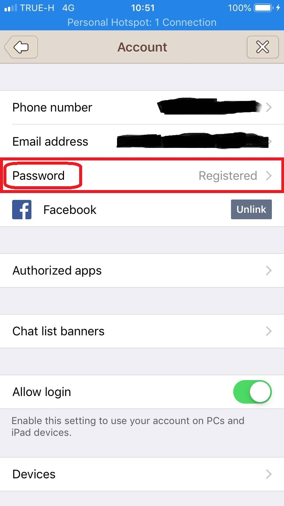

# Test case ID : TC03-2.1.5
* Test case name : **Change password line on PC**

## Preconditions : 
  * Register Line Account with email
  * Open line on mobile
  * Allow login (Enable)
  * Open line on mobile
  * Click Setting  

## Actions : 
  ### Step 1. Click account
  
  
  ### Step 2. Click Password
  
  
  ### Step 3. Touch ID or Enter Passcode
  
  
  
  ### Step 4. Change your password
  

## Expected Result : changed password successfully

## Post Conditions : -)
