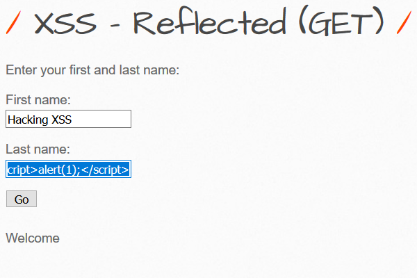
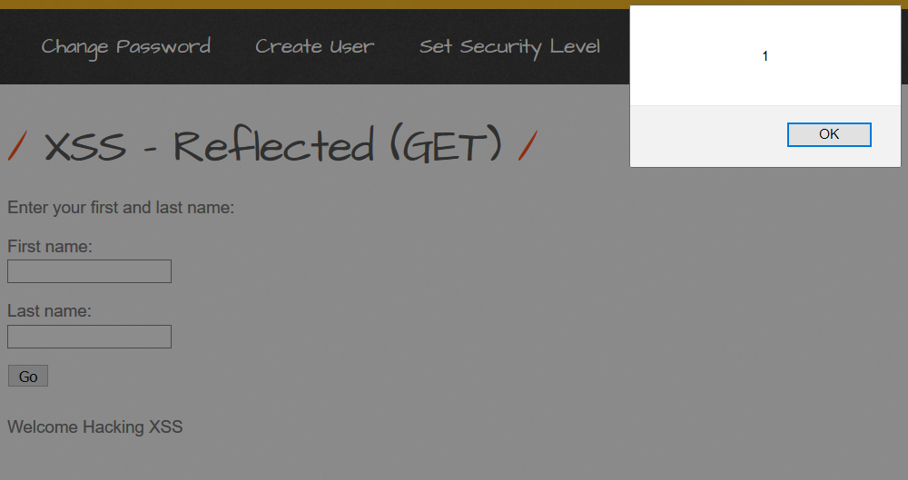
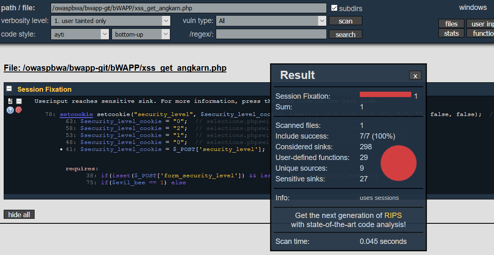
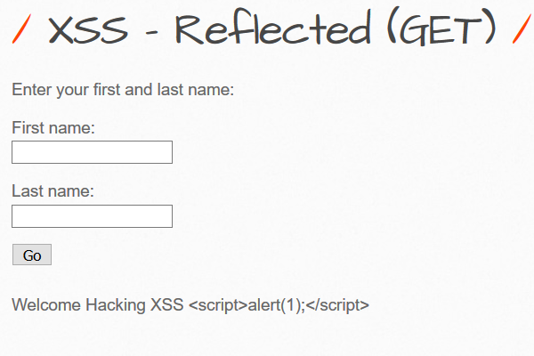

# How to protect XSS_GET from bWAPP (easy level)

## Member group
* MR.ANGKARN  PUMMARIN
* MR.RAKSAPON  LEELACHAT
* MR.TANAPAD  ONSRI

## Test Vulnerability XSS
### Input  
  
  
## Oh!!! 
### Alert
  

## Oh WOW!!!  
### bWAPP XSS_GET
  

## Scan with RIPS 
### Focus Cross-Site Scipting Topic
  
  
## Get Help RIPS
### related securing functions then use it :)
  

## let's fix it

### Original Code

    <?php

    if(isset($_GET["firstname"]) && isset($_GET["lastname"]))
    {   

       * $firstname = $_GET["firstname"];
       * $lastname = $_GET["lastname"];
        

        if($firstname == "" or $lastname == "")
        {

            echo "Please enter both fields...";       

        }

        else            
        { 

            echo "Welcome " . xss($firstname) . " " . xss($lastname);   

        }

    }

    ?>
    
    
    
### Secure Coding
    
     <?php

    if(isset($_GET["firstname"]) && isset($_GET["lastname"]))
    {   

        //$firstname = $_GET["firstname"];
        //$lastname = $_GET["lastname"];
        
      * $firstname = htmlspecialchars($_GET["firstname"]);
      * $lastname = htmlspecialchars($_GET["lastname"]);

        if($firstname == "" or $lastname == "")
        {

            echo "Please enter both fields...";       

        }

        else            
        { 

            echo "Welcome " . xss($firstname) . " " . xss($lastname);   

        }

    }

    ?>
 
## fix is correct  
### Complete
  

## Force will be with you  
### Complete
  
